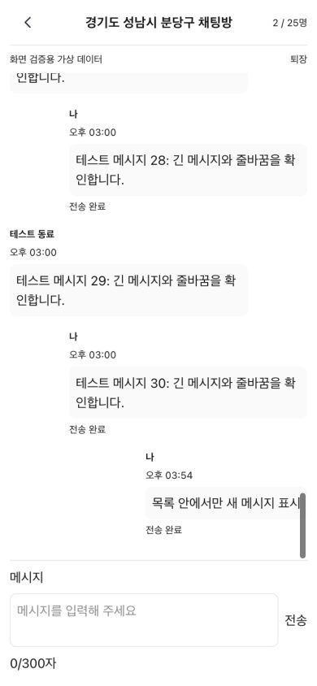

# 지역 채팅 화면 검증 (#134)

2026-10-08. 음악 공동 재생을 제외한 기본 화면과 접속 인원 연동을 검증했다.

## 화면과 상태

상단은 뒤로가기·지역·실제 접속 인원, 가운데는 메시지 목록, 하단은 입력창과 전송 버튼이다. 인증 토큰의 사용자 ID는 내 메시지 정렬에만 사용하며 서버 인증·작성자 정보는 BE가 결정한다. 내 메시지와 대기 메시지는 오른쪽, 다른 사용자는 왼쪽에 표시한다. 닉네임·시간·전송 결과를 제공하며 ACK와 broadcast가 역순이어도 중복 표시하지 않는다.

페이지는 고정하고 메시지 목록만 스크롤한다. 하단 24px 이내에서 새 메시지를 따라가며 이전 메시지를 읽는 중에는 위치를 유지한다. visualViewport의 높이·상단 위치 변경에 맞춰 화면과 입력창 영역을 조정한다. 입력은 Enter 전송, Shift+Enter 줄바꿈, 한글 조합 보호를 유지한다.

접속 인원은 실제 연결 계정 기준이며 같은 계정은 1명이다. 초기 확인 중·연결 끊김·확인 실패를 구분하고 임의의 0명을 표시하지 않는다. 재연결 시 인원 순번을 초기화하고 지난 연결 세대의 메시지·receipt를 무시한다. 퇴장 시 메시지·인원·대기 상태를 정리한다.

## 검증 결과

- FE 전체 35개 파일, 432개 테스트 통과. Prettier·ESLint·프로덕션 빌드 통과.
- BE 실제 WebSocket 통합 테스트에서 송수신·차단·접속 인원 변경을 확인했다.
- 격리된 테스트 BE에 FE의 STOMP 라이브러리와 실제 이벤트 파서를 연결해 초기 인원, 1→2→1 변화, 동일 계정 중복 연결, 텍스트 전달·ACK를 확인했다.
- IAB 브라우저 390×844에서 실제 `ChatRoomScreen`에 가상 메시지 30개를 제공했다. 전송 전후 window.scrollY=0 유지, 하단에서는 목록만 이동, 이전 메시지 읽는 중에는 scrollTop=2605 유지를 확인했다.
- 390×480으로 줄인 뷰포트에서도 입력창·전송 버튼의 하단이 432px로 화면 안에 남았다. 실제 iOS/Android 키보드 동작은 실기기 확인이 남아 있다.

아래 캡처는 실제 UI 컴포넌트의 가상 데이터 화면이다. 실제 계정의 대화 또는 브라우저 두 사용자 연동 캡처는 아니다. 임시 검증 페이지는 제거했다.

